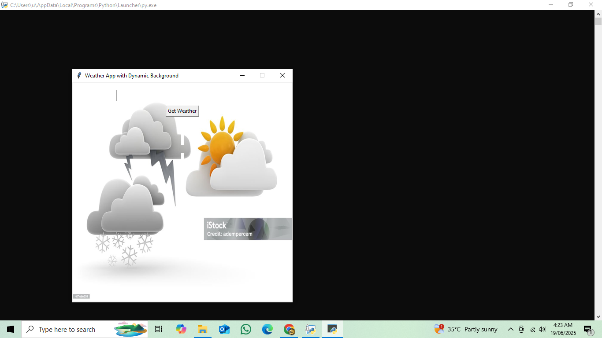

## AUTHOR:
Nagamani Menda

BTech CSE Student

Weather App Project using Python

IBI intern on python

# Weather Forecast Dashboard App

This is a beginner-friendly Weather App built using Python, Tkinter, and the OpenWeatherMap API. It fetches real-time weather data for any city you enter and displays it in a user-friendly interface — with weather-specific icons and dynamic background images based on current conditions.

## Project Overview
The Weather Forecast Dashboard App is a beginner-friendly Python project that fetches real-time weather data for any city using the OpenWeatherMap API. The app features a dynamic background that changes based on weather conditions, such as clear skies, clouds, rain, snow, and storms. It uses Tkinter for the graphical interface and Pillow to handle image processing.

This project is ideal for learning how to:

Interact with public APIs

Parse JSON data

Build desktop GUI apps in Python

Display weather icons and themed backgrounds

Manage files with Git and upload to GitHub

# Users can:

Enter a city name to view the weather

See temperature, humidity, and description

Get a visual background that matches the weather type

## Features

- City-based weather search
- Shows temperature in Celsius
- Weather condition and description
- Humidity and wind speed (basic)
- Weather icons (auto-fetched from OpenWeather)
- Dynamic background that changes for:
  - Clear sky
  - Cloudy
  - Rainy
  - Snowy
  - Thunderstorm
  - Light rain / scattered clouds (optional storm theme)
  - Default fallback
- Snow background triggered if temperature is less than or equal to 2°C

## Screenshots




## How to Run

1. Clone or Download this repository.
2. Make sure you have Python installed (version 3.6 or higher recommended).
3. Install the required libraries:

```bash
pip install requests pillow


Place the following background images in the same folder as your main.py file:

clear.jpg

clouds.jpg

rain.jpg

snow.jpg

storm.jpg

default.jpg

## Run the app:

bash
Copy
Edit
python main.py
# API Used
OpenWeatherMap API: https://openweathermap.org/api
Sign up and get a free API key.
Replace the API_KEY in the code with your personal key.

## File Structure
arduino
Copy
Edit
WeatherApp/
├── main.py
├── clear.jpg
├── clouds.jpg
├── rain.jpg
├── snow.jpg
├── storm.jpg
├── default.jpg
└── README.md

## Future Improvements
Add multi-day forecast (3 to 5 days)

Option to switch between Celsius and Fahrenheit

Toggle between dark mode and light mode

Add sunrise/sunset and air quality information
